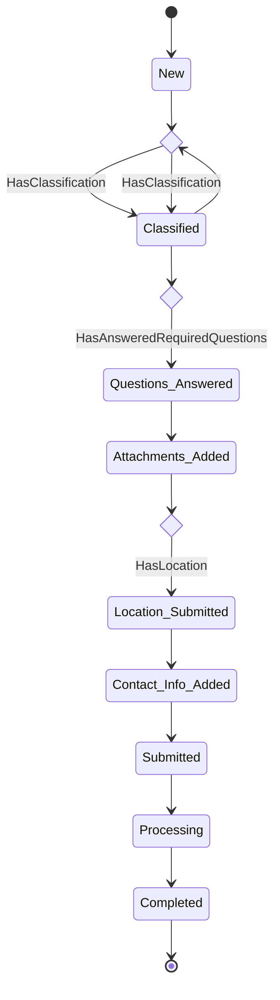

# State Machine
## Diagram

```mermaid
stateDiagram-v2
    [*] --> New
    state HasClassification <<choice>>
    New --> HasClassification
    HasClassification --> Classified: HasClassification
    Classified --> HasClassification
    HasClassification --> Classified: HasClassification
    state HasAnsweredRequiredQuestions <<choice>>
    Classified --> HasAnsweredRequiredQuestions
    HasAnsweredRequiredQuestions --> Questions_Answered: HasAnsweredRequiredQuestions
    Questions_Answered --> Attachments_Added
    state HasLocation <<choice>>
    Attachments_Added --> HasLocation
    HasLocation --> Location_Submitted: HasLocation
    Location_Submitted --> Contact_Info_Added
    Contact_Info_Added --> Submitted
    Submitted --> Processing
    Processing --> Completed
    Completed --> [*]
```
