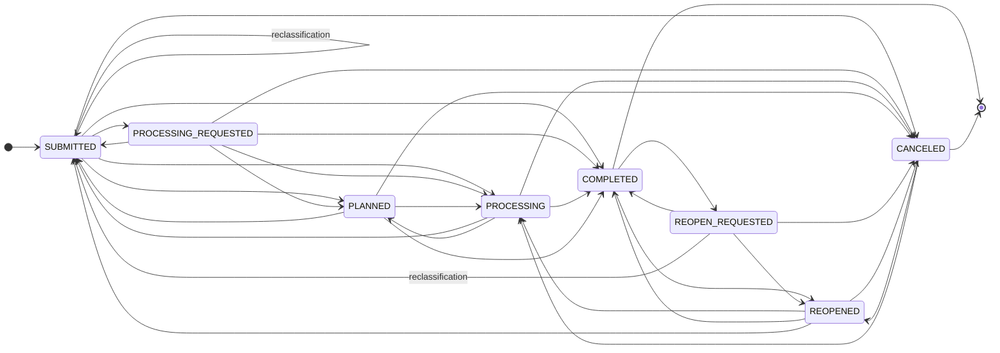

# Melding Process State Machine
This flow chart represents the state machine for the processing of a "melding" in the backoffice. It outlines the various states a melding goes through from submission until completion or cancellation.
The diagram only contains the states and transitions that are defined for Release 1 of the backoffice system.

Transitions labelled "reclassification" are the ones a Behandelaar triggers by assigning a different
classification to the melding, which always returns it to SUBMITTED. The unlabelled edges towards
SUBMITTED are reached by reclassification too, but exist as an ordinary transition as well.
Reclassification is refused for COMPLETED and CANCELED, so those have no edge back.
## Diagram

```mermaid

stateDiagram-v2
    direction LR

    [*] --> SUBMITTED 

    SUBMITTED  --> PROCESSING_REQUESTED 
    SUBMITTED  --> PROCESSING 
    SUBMITTED  --> COMPLETED 
    SUBMITTED  --> CANCELED 
    SUBMITTED  --> PLANNED 
    SUBMITTED  --> SUBMITTED : reclassification

    PROCESSING_REQUESTED  --> SUBMITTED 
    PROCESSING_REQUESTED  --> PLANNED 
    PROCESSING_REQUESTED  --> COMPLETED 
    PROCESSING_REQUESTED  --> PROCESSING 
    PROCESSING_REQUESTED  --> CANCELED 

    PROCESSING  --> SUBMITTED 
    PROCESSING  --> PLANNED 
    PROCESSING  --> COMPLETED 
    PROCESSING  --> CANCELED 

    PLANNED  --> SUBMITTED 
    PLANNED  --> PROCESSING 
    PLANNED  --> COMPLETED 
    PLANNED  --> CANCELED 
    
    CANCELED  --> REOPENED 
    CANCELED  --> PROCESSING
    
    COMPLETED  --> REOPENED 
    COMPLETED  --> REOPEN_REQUESTED
    
    REOPEN_REQUESTED --> COMPLETED
    REOPEN_REQUESTED --> REOPENED
    REOPEN_REQUESTED --> CANCELED
    REOPEN_REQUESTED --> SUBMITTED : reclassification
    
    REOPENED  --> PROCESSING 
    REOPENED  --> COMPLETED 
    REOPENED  --> CANCELED 
    REOPENED  --> SUBMITTED 
    
    COMPLETED  --> [*]
    CANCELED  --> [*]
    
    state COMPLETED <<end>>
    state CANCELED <<end>>
```
