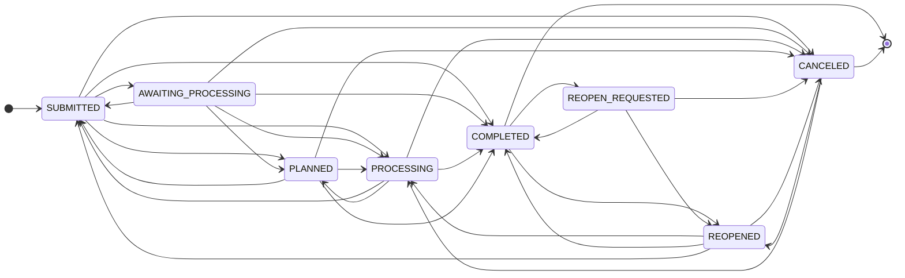

# Melding Process State Machine
This flow chart represents the state machine for the processing of a "melding" in the backoffice. It outlines the various states a melding goes through from submission until completion or cancellation.
The diagram only contains the states and transitions that are defined for Release 1 of the backoffice system.
## Diagram

