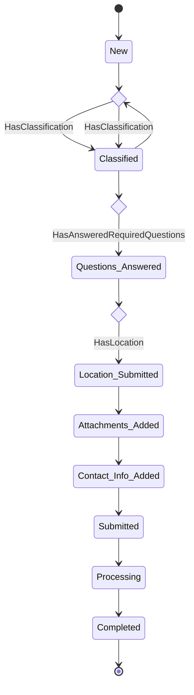

# Melding Submission State Machine
This flow chart represents the state machine for the submission of a "melding" by a melder / reporter through our Melding Form. It outlines the various states a melding goes through from creation until completion when it can be processed by the backoffice. During processing the melding enters a new state and will follow another state machine, see: [melding-process.md](./melding-process.md). 
## Diagram

