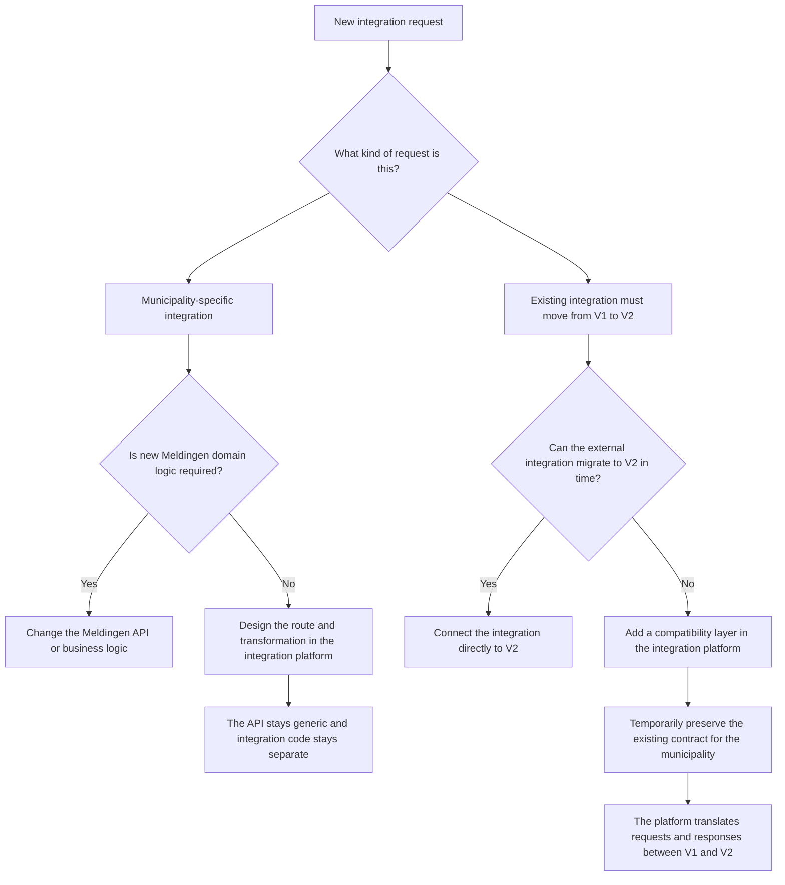

# Integrations in Meldingen

This folder provides a toolkit to create an integration layer between Meldingen and its external connections. It can be deployed next to the API as an optional component. The integration layer uses Apache Camel as its runtime and is configured with routes, filters, and transforms that stay outside the main application code.

Since municipalities have their own types of integrations, deploying Apache Camel with these configuration files is not always sufficient.
Municipalities ultimately are responsible for their own configuration, but we aim to provide common functionality and examples to help create the integration layer.


## Why an integration layer?

The integration layer helps with two recurring situations:

- Not every external integration has a team available to actively migrate. During a move from V1 to V2, the integration platform can provide a compatibility layer so the municipality does not have to wait for changes from the external party.
- Municipality-specific integrations often need their own mappings, filters, or contracts. That logic should not live in the Meldingen API or the business logic.




## Folder structure

In this repository, the integration assets are organized as follows:

```text
integrations/
|-- README.md
|-- docs/
|   `-- poc.md
|-- routes/
|   |-- auth.camel.yaml
|   `-- fetch-meldingen-v1.camel.yaml
`-- tools/
	|-- filters/
	|   `-- v1-state-filter-to-v2.ds
	|-- lib/
	|   `-- common.libsonnet
	`-- transformers/
		`-- meldingen-to-v1.ds
```

The most important files and folders are:

- `README.md`: the entry point for setup, local usage, and the integration folder layout.
- `docs/poc.md`: the PoC description, findings from implementation, and possible next steps.
- `routes/auth.camel.yaml`: Camel Rest configuration, the `/bearer-token` helper endpoint, and the upstream OIDC token request route.
- `routes/fetch-meldingen-v1.camel.yaml`: the `/meldingen-v1` compatibility route, its internal upstream fetch route, and the V1-specific state normalization and transformation flow.
- `tools/filters/v1-state-filter-to-v2.ds`: a DataSonnet filter that maps V1 workflow state aliases to the V2 upstream states before the fetch.
- `tools/transformers/meldingen-to-v1.ds`: a DataSonnet transform that reshapes the V2 response payload into the legacy V1 response contract.
- `tools/lib/common.libsonnet`: shared helper functions used by the DataSonnet filters and transforms.

For the background of this PoC, the tradeoffs found during implementation, and follow-up work, see [docs/poc.md](docs/poc.md).

## Start the stack

From the repository root:

```bash
cp .env.example .env
docker compose up -d --build
docker compose logs -f camel
```

When the PoC is running, you can request a token from Camel's separate auth endpoint.
For the password grant, the caller must now supply the username and password form fields:

```bash
curl -s -X POST http://127.0.0.1:8088/bearer-token \
	--data-urlencode "username=user@example.com" \
	--data-urlencode "password=password"
```

That returns a plain-text value in the form `Bearer <access-token>`.

The compatibility route expects the caller to supply the `Authorization` header themselves. One simple local flow is to request a token first and then pass it to the V1 endpoint:

```bash
TOKEN="$(curl -s -X POST http://127.0.0.1:8088/bearer-token \
	--data-urlencode "username=user@example.com" \
	--data-urlencode "password=password")"
curl -H "Authorization: $TOKEN" http://127.0.0.1:8088/meldingen-v1
```

The V1 endpoint supports the `state` query parameter before transformation:

```bash
curl -H "Authorization: $TOKEN" "http://127.0.0.1:8088/meldingen-v1?state=processing,completed"
```

For the V1 compatibility endpoint, Camel normalizes legacy V1 workflow states to V2 backoffice states before calling the upstream API.
Only V1 states that have a clear V2 equivalent are mapped.

Current V1-to-V2 filter mappings:

- `m` -> `submitted`
- `i` -> `processing_requested`
- `b` -> `processing`
- `ingepland` -> `planned`
- `o` -> `completed`
- `a` -> `canceled`
- `reopened` -> `reopened`
- `reopen requested` -> `reopen_requested`

Other legacy-only V1 workflow states do not get a compatibility mapping yet and are treated as unmatched by the upstream V2 filter.

You can inspect the generated OpenAPI document at:

```bash
curl http://127.0.0.1:8088/openapi
```

## Public endpoints

Camel listens on `127.0.0.1:8088` on the host and is only published on loopback. The public HTTP edge is declared with Camel Rest DSL and the internal logic stays on `direct:` routes.

The generated OpenAPI currently documents these public endpoints:

- `POST /bearer-token`: helper endpoint for obtaining a bearer token from the configured OIDC provider.
- `GET /meldingen-v1`: compatibility endpoint that fetches from the upstream V2 API and transforms the response to the V1 contract.
- `GET /openapi`: generated Camel OpenAPI document.

The first supported compatibility filter is `state`. Camel allowlists that query parameter and forwards it to the upstream API. Later filters such as category slug can be added in the same way once the backend exposes them.